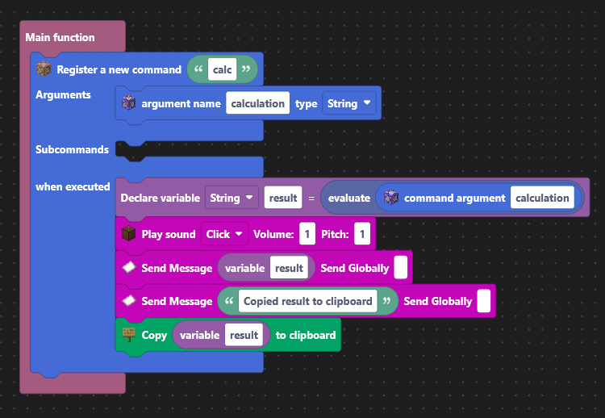

# Simple-Calculator
## Features & Usage
Simple Calculator is a Simple mod which adds the feature to do equations.
You can use the mod by typing `/calc <equation>`. 
The output will be copied to your clipboard and will be sent in chat.

## About
This Mod was made with ModWizard. ModWizard is a tool that allows anybody to make minecraft mods without any coding expereince. (ModWizard ist still under development and currently in closed beta)

